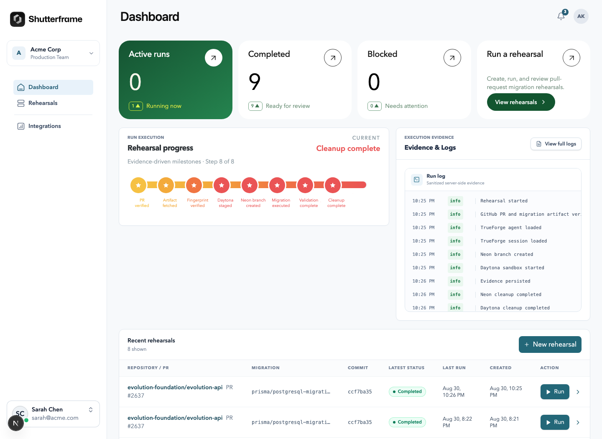
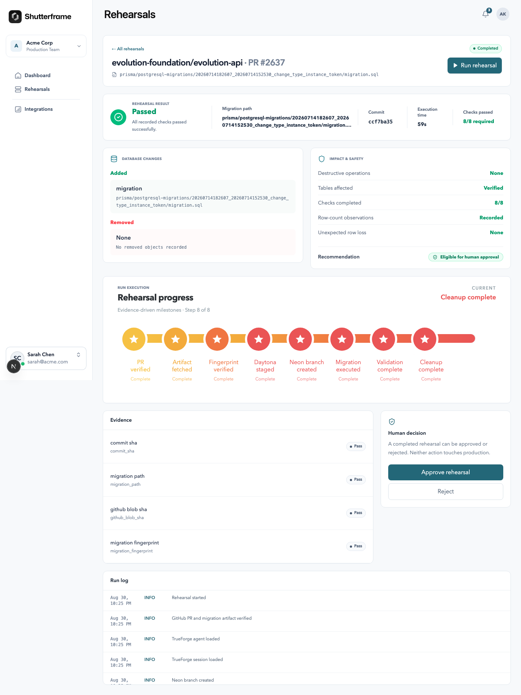
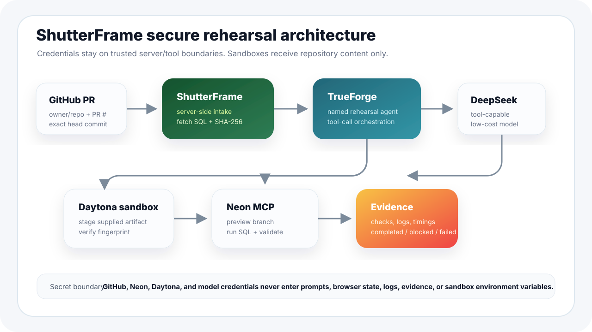
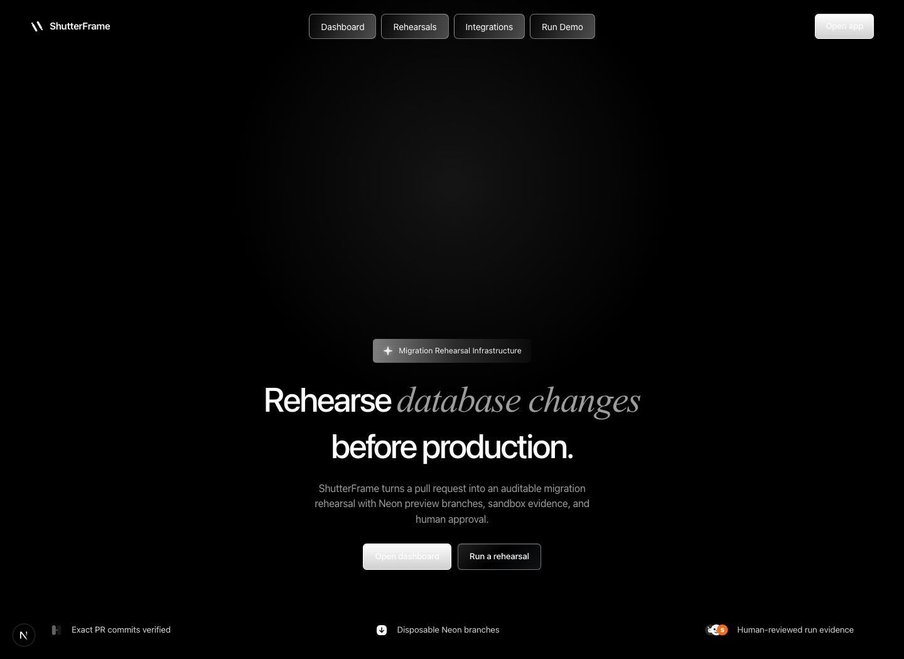
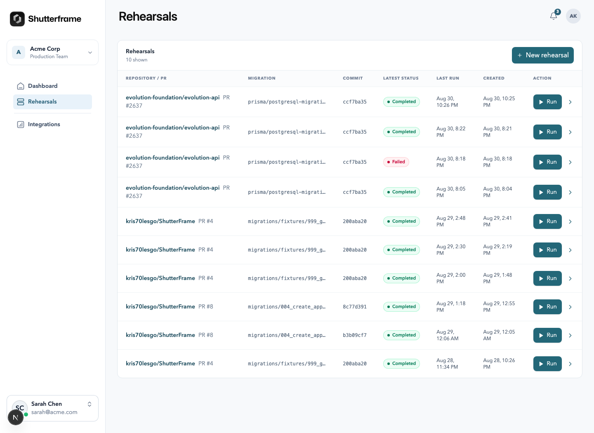

# ShutterFrame

> Rehearse pull-request database migrations before they are trusted anywhere near production.

ShutterFrame is a secure migration rehearsal control room for PostgreSQL teams. It takes a pull request, verifies the exact commit, fetches the exact SQL migration artifact server-side, stages it in an isolated sandbox for fingerprint verification, applies it only to a disposable Neon preview branch through TrueForge tooling, runs deterministic validation, stores auditable evidence, and then gives a human reviewer a clear approve/reject checkpoint.

It is built for the scary moment before a migration merges: “Will this SQL actually behave safely against a production-shaped database?”



## Why this exists

Database migrations are reviewed like ordinary code, but they behave like infrastructure events:

- a column drop can silently break application assumptions;
- an index can lock or slow a hot table;
- a foreign-key change can expose dirty data;
- a migration can work locally but fail against realistic schema/data shape;
- screenshots, terminal logs, and “LGTM” comments are weak audit trails.

ShutterFrame turns that risk into a repeatable rehearsal:

```text
GitHub PR
→ exact head commit verification
→ server-side migration artifact fetch
→ SHA-256 fingerprint
→ TrueForge rehearsal agent
→ Daytona sandbox artifact verification
→ Neon preview branch
→ migration execution
→ deterministic checks
→ evidence + logs
→ human decision
```

## Demo flow

1. Open the app at `http://localhost:3000`.
2. Go to **Rehearsals**.
3. Click **New rehearsal**.
4. Enter a public repository owner, repository name, and PR number.
5. ShutterFrame verifies the pull request and starts a real rehearsal.
6. Watch the progress milestones advance from PR verification to cleanup.
7. Review the result, evidence, impact summary, and sanitized logs.



## What ShutterFrame proves

ShutterFrame does not ask an AI model whether a migration “looks safe.” The model helps orchestrate tools, but final status is deterministic:

| Final status | Meaning |
| --- | --- |
| `completed` | Required checks passed and cleanup completed or was recorded. |
| `blocked` | The migration or validation failed in a meaningful way, such as an integrity or artifact mismatch. |
| `failed` | Infrastructure, credentials, provider, or orchestration failed before a trustworthy rehearsal result could be produced. |

The application persists structured evidence for the important parts of the run:

- commit SHA;
- migration path;
- GitHub blob SHA;
- migration SHA-256 fingerprint;
- Daytona fingerprint verification;
- Neon branch creation;
- migration execution;
- schema integrity;
- foreign-key / constraint checks;
- row-count observations;
- smoke query;
- duration;
- cleanup.

## Architecture



The most important design rule is simple: credentials stay out of prompts and sandboxes.

ShutterFrame uses a trusted server-side GitHub artifact flow instead of authenticated private `git clone` inside Daytona. The server verifies the PR and fetches the migration at the exact commit using server-only GitHub credentials. From that point onward, TrueForge and Daytona receive only safe repository content and metadata:

- repository owner/name;
- PR number;
- exact commit SHA;
- migration path;
- migration SQL content;
- migration fingerprint.

Daytona never receives `GITHUB_TOKEN`, Neon connection strings, or database URLs. It stages the supplied migration artifact and independently verifies its SHA-256 fingerprint. Neon operations happen through Neon MCP tools exposed to the TrueForge rehearsal agent.

### Runtime ownership

| Layer | Responsibility |
| --- | --- |
| Next.js app | UI, intake routes, server-side GitHub artifact retrieval, evidence display. |
| ShutterFrame database | Rehearsals, runs, evidence, sanitized logs, approvals. |
| TrueForge | Named rehearsal agent, model provider, MCP tools, Daytona sandbox tool calls. |
| DeepSeek | Low-cost tool-capable model provider used by the TrueForge rehearsal agent. |
| Neon MCP | Disposable preview branches, SQL execution, schema/constraint checks, cleanup. |
| Daytona sandbox | Artifact staging and SHA-256 verification only; no database access. |
| GitHub | Source PR, exact commit, exact SQL migration artifact. |

### Why not Groq?

Groq was removed from the core rehearsal path because the TrueForge/Groq multi-step tool loop failed when `reasoning_content` was replayed during multi-turn tool execution. ShutterFrame now uses DeepSeek through TrueForge for the rehearsal agent.

## Screenshots

### Landing page



### Dashboard


### Rehearsal list



### Rehearsal progress and evidence


## Tech stack

- Next.js App Router
- React 19
- TypeScript
- Tailwind CSS
- Motion-powered UI details
- Neon serverless PostgreSQL
- TrueForge v0.1.4
- Daytona sandbox via TrueForge
- DeepSeek OpenAI-compatible provider via TrueForge
- Vitest
- Playwright
- pnpm

## Repository layout

```text
app/
  api/
    rehearsals/             # Stable API routes for intake and run start
    runs/[id]/approval/     # Human decision endpoint
  dashboard/                # Dashboard page
  rehearsals/               # Rehearsal list/detail pages

components/shutterframe/
  live-rehearsal-ui.tsx     # Main dashboard, list, detail, evidence UI
  new-rehearsal-form.tsx    # Modal intake form
  start-rehearsal-form.tsx  # Run/re-run control

lib/
  database/                 # Rehearsals, runs, evidence, logs
  github/                   # Server-side PR + artifact retrieval
  rehearsal-engine/         # Classification, redaction, orchestration entry
  trueforge/                # Rehearsal agent/session integration

migrations/                 # ShutterFrame app schema
scripts/                    # Doctor and verification commands
tests/                      # Unit and integration-oriented checks
docs/assets/                # README screenshots and diagrams
```

## Prerequisites

- Node.js `>=22.13.0`
- pnpm via Corepack
- GitHub token for server-side artifact retrieval
- Neon development project/API key
- Daytona API key
- DeepSeek API key
- Local TrueForge process

Install dependencies:

```bash
corepack enable
pnpm install
```

Create local environment:

```bash
cp .env.example .env.local
```

Then fill in `.env.local`. It is ignored by git.

## Environment variables

Only server-side environment variables are used. There are intentionally no `NEXT_PUBLIC_` secrets.

| Variable | Purpose |
| --- | --- |
| `DATABASE_URL` | ShutterFrame application database. |
| `TRUEFORGE_BASE_URL` | Local TrueForge URL, usually `http://localhost:8790`. |
| `DEEPSEEK_API_KEY` | Model provider key configured through TrueForge tooling. |
| `NEON_API_KEY` | Development-only Neon API key. |
| `NEON_PROJECT_ID` | Development-only Neon project. |
| `GITHUB_TOKEN` | Server-side GitHub artifact retrieval. |
| `GITHUB_OWNER` | Optional verifier fixture owner. |
| `GITHUB_REPO` | Optional verifier fixture repository. |
| `GITHUB_INTAKE_PR_NUMBER` | Optional verifier fixture PR number. |
| `SHUTTERFRAME_INTAKE_TOKEN` | Server-to-server intake token. |
| `DAYTONA_API_KEY` | Daytona provisioning key used by TrueForge. |
| `DAYTONA_API_URL` | Daytona API base URL. |

Security expectations:

- never commit `.env.local`;
- never expose provider keys to browser code;
- never pass `DATABASE_URL` to TrueForge prompts or Daytona;
- never place GitHub credentials in sandbox environment variables;
- keep Neon credentials scoped to development rehearsal resources.

## Running locally

Start TrueForge:

```bash
pnpm trueforge
```

Start the app:

```bash
pnpm dev
```

Open:

```text
http://localhost:3000
```

Check local configuration:

```bash
pnpm run doctor
```

## Running a rehearsal

From the UI:

1. Navigate to `/rehearsals`.
2. Click **New rehearsal**.
3. Enter:
   - owner;
   - repository;
   - PR number.
4. Click **Start rehearsal**.

The server will:

1. fetch the PR metadata from GitHub;
2. verify the head commit;
3. find a safe SQL migration artifact;
4. calculate the SHA-256 fingerprint;
5. create a queued rehearsal;
6. start the rehearsal engine in the background;
7. stream progress through persisted run/evidence/log state.

The UI auto-refreshes active rehearsals so progress advances without a manual page reload.

## Verification commands

Run the standard local quality gate:

```bash
pnpm lint
pnpm typecheck
pnpm test
pnpm build
```

Run focused integration checks:

```bash
pnpm verify:database
pnpm verify:github-intake
pnpm verify:integrations
pnpm verify:trueforge-session
pnpm verify:rehearsal-engine
```

Run everything in the normal project check:

```bash
pnpm check
```

Current expected lint state: the build may show existing Next.js warnings about `` usage in base avatar/badge components. They are warnings, not blocking errors.

## Rehearsal lifecycle

```text
queued
  ↓
starting
  ↓
branching
  ↓
sandbox_starting
  ↓
migration_running
  ↓
validating
  ↓
completed | blocked | failed
```

Duplicate active execution is protected: ShutterFrame refuses to accidentally start a second active run for the same rehearsal.

## Evidence model

Evidence is intentionally compact. ShutterFrame stores enough to review and audit the run without dumping huge raw schemas, secrets, or provider payloads.

Examples:

```text
commit_sha: pass
migration_path: pass
github_blob_sha: pass
migration_fingerprint: pass
daytona_fingerprint_verification: pass
migration_execution: pass
schema_integrity: pass
foreign_keys: pass
row_counts: pass/warning
smoke_query: pass
duration: pass
cleanup: pass
```

Logs are sanitized before persistence. Credential-looking values, database URLs, tokens, and authorization material are redacted.

## Human decision

ShutterFrame separates rehearsal from production. A completed run can be approved or rejected by a human reviewer, but approval does not execute production migration work. Production execution, rollback execution, organizations, auth, and GitHub webhooks are intentionally outside this focused demo scope.

## Demo readiness

The project currently supports:

- public GitHub PR intake;
- exact commit and migration artifact verification;
- DeepSeek-backed TrueForge rehearsal orchestration;
- Daytona artifact staging/fingerprint verification;
- Neon preview branch execution through MCP;
- deterministic validation;
- evidence/log persistence;
- cleanup recording;
- interactive dashboard and rehearsal UI;
- landing page;
- local demo recording workflow.

## Useful scripts

| Command | Purpose |
| --- | --- |
| `pnpm dev` | Run the Next.js development server. |
| `pnpm trueforge` | Run local TrueForge. |
| `pnpm run doctor` | Check required local configuration. |
| `pnpm verify:integrations` | Verify TrueForge → DeepSeek path. |
| `pnpm verify:rehearsal-engine` | Run a configured end-to-end rehearsal verifier. |
| `pnpm check` | Lint, typecheck, unit tests, and production build. |

## Troubleshooting

### Rehearsals page says the database read failed

Check:

```bash
pnpm run doctor
```

Then confirm `DATABASE_URL` is present in `.env.local` and the app schema migrations have been applied.

### TrueForge is unreachable

Start TrueForge in another terminal:

```bash
pnpm trueforge
```

Then verify:

```bash
curl http://localhost:8790/api/v1/capabilities
```

### A run stays queued

Usually this means the background engine did not start or failed early. Check persisted logs for that run and confirm:

- `TRUEFORGE_BASE_URL` is reachable;
- DeepSeek provider is configured in TrueForge;
- Neon MCP is configured;
- Daytona provider is configured;
- the PR contains a safe `.sql` migration file.

### A public PR says no SQL migration was found

ShutterFrame intentionally looks for safe `.sql` files. It ignores path traversal and suspicious file paths. If the PR has no SQL migration artifact, there is nothing safe to rehearse.

## Security design

ShutterFrame’s secure-by-default choices:

- GitHub credentials stay server-side.
- The exact SQL artifact is fetched by the trusted server layer.
- SHA-256 is calculated from exact bytes before orchestration.
- TrueForge receives repository content, not repository credentials.
- Daytona receives staged artifact content, not GitHub tokens.
- Neon operations go through Neon MCP, not raw connection URLs in prompts.
- Logs and evidence are redacted.
- `.env.local` is ignored by git.


